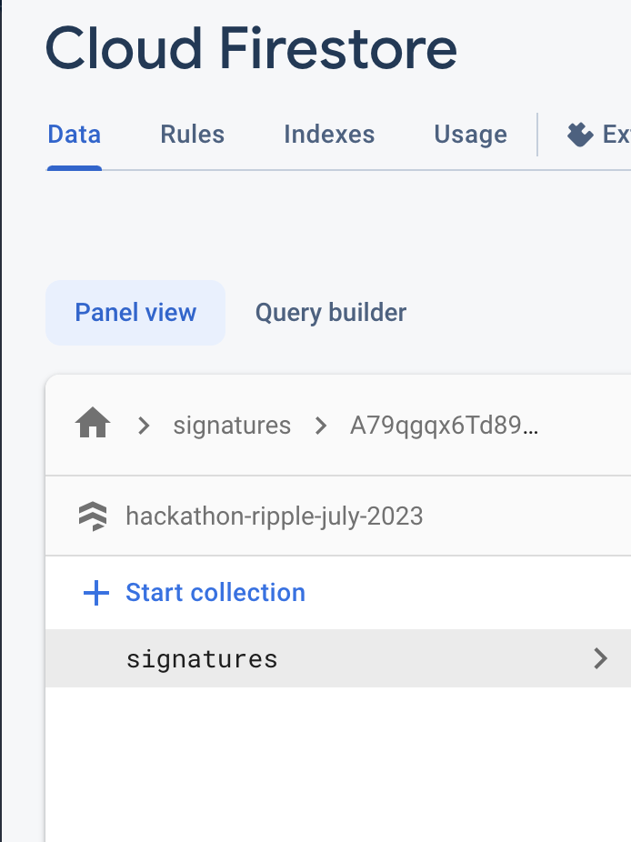

# Frontend

This application is the React frontend interacting with the Solidity Smart Contract.

It is written using [Vite.js](https://vitejs.dev/) and [Ripple design system](https://ripple.github.io/ui-toolkit/?path=/docs/about--docs).

## Installation

Follow the steps:

1. cd into `frontend`
2. Run `npm install` (Node 16 was used for this repo)
3. Copy `.env.local.example` and rename the copy to `.env.local`
4. In `.env.local` edit all the blank values. Make sure that no space is after the `=` sign.

```
VITE_API_KEY=
VITE_AUTH_DOMAIN=
VITE_PROJECT_ID=
VITE_STORAGE_BUCKET=
VITE_MESSAGING_SENDER_ID=
VITE_APP_ID=

VITE_TITLE=WalletID

VITE_SMART_CONTRACT_ADDRESS=
```

You can create a new Google Firestore Database and get the connection details for the `.env.local` file.
From 8:50, you can see how to create that Firestore Database in this [YouTube video](https://www.youtube.com/watch?v=jCY6DH8F4oc&t=530s).

Once the firstore database is created, make sure to create a `signatures` collection in it.



Check the Smart Contract [readme](../smart-contracts/README.md) to know how to get your smart contract address.

5. Start the app with `npm run dev`
6. See the application running at `http://localhost:5173`
